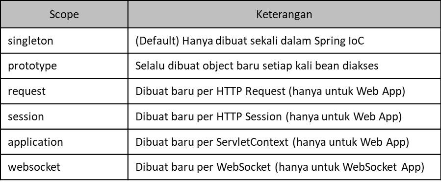

# Scope

- Scope merupakan `strategy cara sebuah object dibuat`
- Secara `default` strategy di Spring adalah `singleton`, artinya hanya dibuat sekali, dan ketika kita mengaksesnya, maka akan dikembalikan object yang sama
- Namun, kita juga bisa mengubah scope bean yang kita mau di Spring
- Untuk mengubah scope sebuah bean, kita bisa tambahkan annotation @Scope(value="namaScope")

# Bean Scope

- Jenis-jenis bean scope

    

