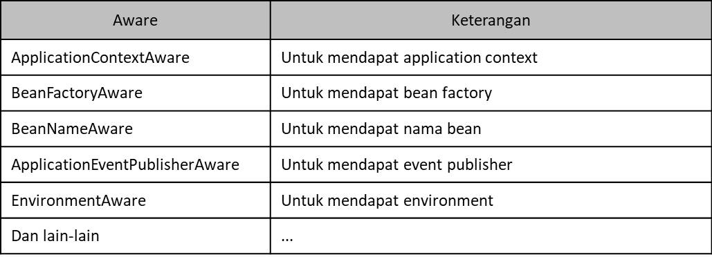

# Aware

- Spring memiliki sebuah interface bernama Aware
- Aware adalah super interface yang digunakan untuk semua Aware interface
- Aware ini diperuntukkan `untuk penanda agar Spring melakukan injection object` yang kita butuhkan
- Mirip seperti yang sudah kita lakukan ketika membuat IdAware menggunakan IdGenerator Bean Post Processor
- Namun untuk ini, kita tidak perlu lagi membuat Bean Post Processor secara manual
- Daftar aware

    

