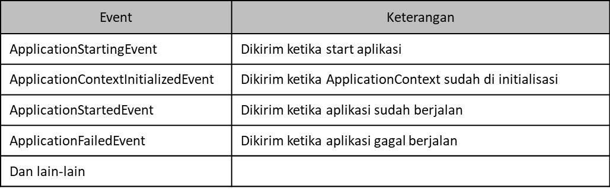

# Spring Application Event

- Sebelumnya kita sudah belajar tentang Event Listener
- Di Spring Boot, terdapat banyak sekali Event yang dikirim ketika aplikasi Spring Boot berjalan
- Jika kita ingin, maka kita bisa membuat Listener untuk menerima event tersebut

    

# Menambah Listener

- Beberapa Event di Spring Boot Application Event di trigger bahkan sebelum Spring membuat Application Context
- Oleh karena itu, jika kita buat menggunakan bean, bisa saja beberapa listener tidak akan dipanggil, karena bean nya belum dibuat
- Agar lebih aman, kita bisa menambahkan `listener` ketika membuat `SpringApplication`